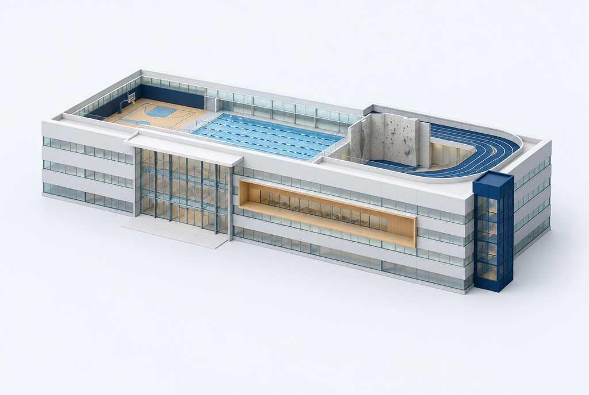

# A Rec that becomes yours

## Review of the existing app

The bundled Rec photograph, generous typography, and calm navy/white app are the foundation. The current welcome automatically leaves after 1.8 seconds; questions restart the same fade; progress marks the current unanswered question complete. Generic sparkles and identical activity symbols lose the connection to Storrs. On web, the phone changes size when onboarding ends.

## Direction before implementation

Keep one persistent architectural illustration across the questions. Let the answers light up a few relevant Rec spaces. Carry that illustration and those interests into Home. Use a deliberately simplified building illustration, not a floor plan or wayfinding claim.

- Color: Husky navy #000E2F, white #FFFFFF, royal action blue #013ECD, ice #ECF2FF, slate #69768C, midnight #101B2C. Retain the existing photo and quiet dark onboarding.
- Type: keep native system sans; 34–39 px main headings, 17 px section titles, 14–16 px controls. Text is left aligned, with normal font scaling.
- Layout: persistent brand / progress / architectural vignette, then one scrollable question, then a stable action footer. Home retains its photo hero and gains an explorable Rec vignette.
- Identity: original building and activity emblems inspired by the glass façade, track, court markings, pool lanes, and climbing holds. Preserve recognizable meaning and text labels.
- Motion: one brief entrance; directional question changes; short confirmation on selection; no timed advance, idle pulse, artificial wait, confetti, or required motion. Reduced motion updates instantly.

```text
Brand                              Close
Completed progress ━━━━━───────────────
[Rec vignette]  A little more you.
Back                           Your interests
What moves you?
Search / activity groups / choices
───────────────────────────────────────
Continue to friends
```

## Critique of the plan

A standalone mascot badge or generic 3D gym would look decorative. The building is the single memorable element instead: it persists, reflects actual choices, and returns in Home. Keep the existing restrained palette and photographic welcome rather than changing the app's aesthetic wholesale. Essential actions remain labeled and usable without the illustration.

## 3D development path



Generated with Higgsfield GPT Image 2.5, job `21a723fe-32ae-4d48-9228-ac10bf0d06c9`. This is a material and composition study, not a measured reconstruction or a navigable 3D asset. Its rooftop cutaway is illustrative. The image stays in the design references and is not downloaded by the app at runtime.

The first implementation uses lightweight vector depth and semantic space IDs. A Higgsfield architectural concept explores the material direction separately; it is an illustration, not an accurate model. A future GLB should be built from verified photos and floor plans, with independently named meshes for the entrance, track, courts, aquatics, studios, and climbing wall. Those mesh IDs can consume the same selection state. Keep a static fallback, load the 3D asset only when exploring, and avoid an always-running camera. Actual room locations must be verified before navigation is offered.

## References

- [UConn brand palette](https://brand.uconn.edu/visual-identity/guidelines/)
- [Published Rec amenities](https://recreation.uconn.edu/src/)
- [Expo SDK 57 reference](https://docs.expo.dev/versions/v57.0.0/)
